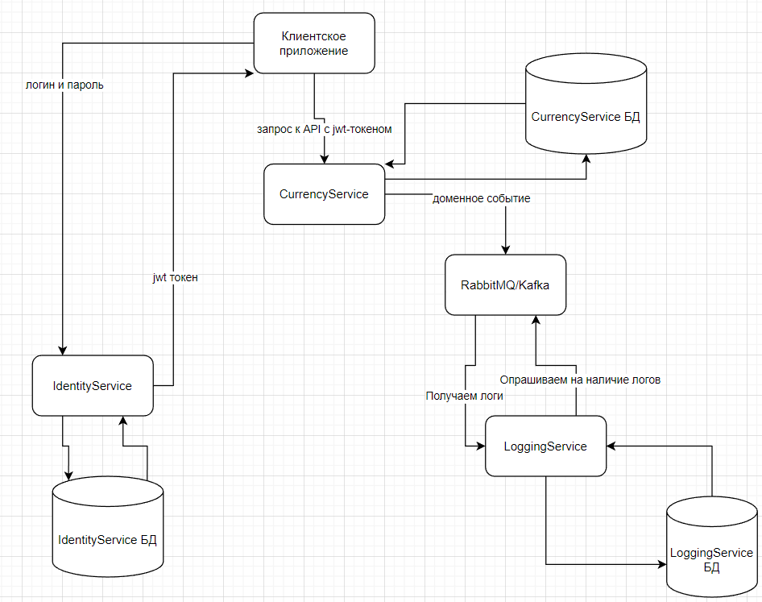
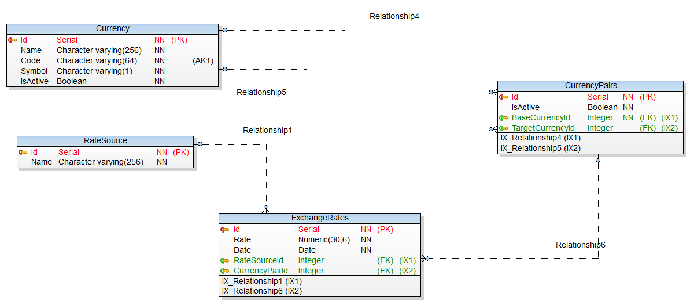

# CurrencyService

CurrencyService - сервис, отвечающий за предоставление информации о курсах валют, а также за преобразование одной валюты в другую.

Особенности:

* Кэширование актуальных курсов валют:
    * Использование Redis для кэширования данных и ускорения доступа.
* Кэширование результатов конвертации:
    * Кэширование часто запрашиваемых результатов конвертации.

## Стек технологий

* Язык: C#.
* Фреймворк: ASP.NET Core.
* База данных: PostgreSQL.
* Кэш: Redis.
* Логирование: Serilog + ELK Stack.
* Планировщик задач: Quartz.NET.

## Возможности
### Для внешних сервисов

* Получение всех поддерживаемых валют
* Получение всех поддерживаемых валютных пар
* Получение курса определенной валюты относительно другой, выбранной валюты
* Получение курса определенной валюты относительно всех других валют (для которых есть курс)
* Получение курса определенной валюты относительно других валют (для которых есть курс), представленных в виде списка
* Предоставление всех перечисленных выше данных на определенную дату или временной интервал в прошлом (историчность)
* Конвертация суммы из одной валюты в другую по актуальному курсу
* Конвертация суммы из одной валюты в другую через промежуточную валюту (если нет прямого курса)

### Административные

Все возможности из пункта [Для внешних сервисов](#для-внешних-сервисов) плюс следующие:

* Принудительный запуск процесса получения актуальных курсов с источника
* Смена источника курсов валют
* Архивация/разархивация определенной валюты
* Архивация/разархивация определенной валютной пары
* Настройка интервала автоматического получения курсов валют с источника
* Ручное обновление курса валют

(Дополнительно)
* Логирование операций:
    * Логирование всех операций, связанных с получением и обновлением курсов валют.
    * Логирование ошибок и важных событий.
* Мониторинг:
    * Отслеживание состояния сервиса (например, время выполнения операций, количество ошибок).

## Описание API
### **Базовый URL**
```
https://currencyservice/
```

---

### **1. Публичные методы (для внешних сервисов)**

#### **1.1. Получение всех поддерживаемых валют**
- **Описание**: Возвращает список всех валют, поддерживаемых сервисом.
- **Метод**: `GET /currencies`
- **Параметры**: Нет
- **Ответ**:
  ```json
  [
    {
      "code": "USD",
      "name": "Доллар США",
      "symbol": "$",
      "isActive": true
    },
    {
      "code": "EUR",
      "name": "Евро",
      "symbol": "€",
      "isActive": true
    }
  ]
  ```

#### **1.2. Получение всех поддерживаемых валютных пар**
- **Описание**: Возвращает список всех валютных пар, для которых есть курсы.
- **Метод**: `GET /currency-pairs`
- **Параметры**: Нет
- **Ответ**:
  ```json
  [
    {
      "baseCurrency": "USD",
      "targetCurrency": "RUB",
      "isActive": true
    },
    {
      "baseCurrency": "EUR",
      "targetCurrency": "RUB",
      "isActive": true
    }
  ]
  ```

#### **1.3. Получение курса определенной валюты относительно другой**
- **Описание**: Возвращает курс одной валюты относительно другой.
- **Метод**: `GET /rates/{baseCurrency}/{targetCurrency}`
- **Параметры**:
  - `baseCurrency`: Код базовой валюты (например, `USD`).
  - `targetCurrency`: Код целевой валюты (например, `RUB`).
- **Ответ**:
  ```json
  {
    "baseCurrency": "USD",
    "targetCurrency": "RUB",
    "rate": 75.50,
    "date": "2023-10-01T12:00:00Z"
  }
  ```

#### **1.4. Получение курса определенной валюты относительно всех других валют**
- **Описание**: Возвращает курс одной валюты относительно всех других валют, для которых есть курсы.
- **Метод**: `GET /rates/{baseCurrency}`
- **Параметры**:
  - `baseCurrency`: Код базовой валюты (например, `USD`).
- **Ответ**:
  ```json
  [
    {
      "targetCurrency": "RUB",
      "rate": 75.50,
      "date": "2023-10-01T12:00:00Z"
    },
    {
      "targetCurrency": "EUR",
      "rate": 0.85,
      "date": "2023-10-01T12:00:00Z"
    }
  ]
  ```

#### **1.5. Получение курса определенной валюты относительно списка валют**
- **Описание**: Возвращает курс одной валюты относительно списка других валют.
- **Метод**: `POST /rates/{baseCurrency}/list`
- **Параметры**:
  - `baseCurrency`: Код базовой валюты (например, `USD`).
  - Тело запроса:
    ```json
    {
      "targetCurrencies": ["RUB", "EUR"]
    }
    ```
- **Ответ**:
  ```json
  [
    {
      "targetCurrency": "RUB",
      "rate": 75.50,
      "date": "2023-10-01T12:00:00Z"
    },
    {
      "targetCurrency": "EUR",
      "rate": 0.85,
      "date": "2023-10-01T12:00:00Z"
    }
  ]
  ```

#### **1.6. Получение исторических данных**
- **Описание**: Возвращает курсы валют на определенную дату или за временной интервал.
- **Метод**: `GET /rates/history`
- **Параметры**:
  - `baseCurrency`: Код базовой валюты (например, `USD`).
  - `targetCurrency`: Код целевой валюты (например, `RUB`).
  - `date`: Дата в формате `YYYY-MM-DD` (опционально).
  - `startDate`: Начало временного интервала (опционально).
  - `endDate`: Конец временного интервала (опционально).
- **Ответ**:
  ```json
  [
    {
      "baseCurrency": "USD",
      "targetCurrency": "RUB",
      "rate": 75.50,
      "date": "2023-10-01T12:00:00Z"
    },
    {
      "baseCurrency": "USD",
      "targetCurrency": "RUB",
      "rate": 76.00,
      "date": "2023-10-02T12:00:00Z"
    }
  ]
  ```

#### **1.7. Конвертация суммы из одной валюты в другую**
- **Описание**: Конвертирует сумму из одной валюты в другую по актуальному курсу.
- **Метод**: `GET /convert`
- **Параметры**:
  - `from`: Код исходной валюты (например, `USD`).
  - `to`: Код целевой валюты (например, `RUB`).
  - `amount`: Сумма для конвертации.
- **Ответ**:
  ```json
  {
    "from": "USD",
    "to": "RUB",
    "amount": 100,
    "convertedAmount": 7550.00,
    "rate": 75.50,
    "date": "2023-10-01T12:00:00Z"
  }
  ```

#### **1.8. Конвертация суммы через промежуточную валюту**
- **Описание**: Конвертирует сумму из одной валюты в другую через промежуточную валюту, если нет прямого курса.
- **Метод**: `GET /convert/indirect`
- **Параметры**:
  - `from`: Код исходной валюты (например, `USD`).
  - `to`: Код целевой валюты (например, `CNY`).
  - `amount`: Сумма для конвертации.
- **Ответ**:
  ```json
  {
    "from": "USD",
    "to": "CNY",
    "amount": 100,
    "convertedAmount": 700.00,
    "rate": 7.00,
    "intermediateCurrency": "RUB",
    "date": "2023-10-01T12:00:00Z"
  }
  ```

---

### **2. Административные методы**

#### **2.1. Принудительный запуск процесса получения актуальных курсов**
- **Описание**: Запускает процесс обновления курсов валют с источника.
- **Метод**: `POST /admin/refresh-rates`
- **Параметры**: Нет
- **Ответ**:
  ```json
  {
    "message": "Курсы валют успешно обновлены"
  }
  ```

#### **2.2. Смена источника курсов валют**
- **Описание**: Изменяет источник данных для получения курсов валют.
- **Метод**: `POST /admin/change-source`
- **Параметры**:
  - Тело запроса:
    ```json
    {
      "source": "ЦБ РФ"
    }
    ```
- **Ответ**:
  ```json
  {
    "message": "Источник курсов изменен на ЦБ РФ"
  }
  ```

#### **2.3. Архивация/разархивация валюты**
- **Описание**: Архивирует или разархивирует валюту.
- **Метод**: `POST /admin/currencies/{currencyCode}/archive`
- **Параметры**:
  - `currencyCode`: Код валюты (например, `USD`).
  - Тело запроса:
    ```json
    {
      "isArchived": true
    }
    ```
- **Ответ**:
  ```json
  {
    "message": "Валюта USD успешно архивирована"
  }
  ```

#### **2.4. Архивация/разархивация валютной пары**
- **Описание**: Архивирует или разархивирует валютную пару.
- **Метод**: `POST /admin/currency-pairs/{baseCurrency}/{targetCurrency}/archive`
- **Параметры**:
  - `baseCurrency`: Код базовой валюты (например, `USD`).
  - `targetCurrency`: Код целевой валюты (например, `RUB`).
  - Тело запроса:
    ```json
    {
      "isArchived": true
    }
    ```
- **Ответ**:
  ```json
  {
    "message": "Валютная пара USD/RUB успешно архивирована"
  }
  ```

#### **2.5. Настройка интервала автоматического обновления курсов**
- **Описание**: Устанавливает интервал автоматического обновления курсов валют.
- **Метод**: `POST /admin/refresh-interval`
- **Параметры**:
  - Тело запроса:
    ```json
    {
      "intervalInMinutes": 60
    }
    ```
- **Ответ**:
  ```json
  {
    "message": "Интервал обновления курсов установлен на 60 минут"
  }
  ```

#### **2.6. Ручное обновление курса валют**
- **Описание**: Ручное обновление курса для конкретной валютной пары.
- **Метод**: `POST /admin/rates/{baseCurrency}/{targetCurrency}`
- **Параметры**:
  - `baseCurrency`: Код базовой валюты (например, `USD`).
  - `targetCurrency`: Код целевой валюты (например, `RUB`).
  - Тело запроса:
    ```json
    {
      "rate": 75.50
    }
    ```
- **Ответ**:
  ```json
  {
    "message": "Курс USD/RUB успешно обновлен"
  }
  ```


## Архитектура
### Взаимодействие с другими сервисами


CurrencyService непосредственно взаимодействует с IdentityService, а также с LoggingService через очередь сообщений.


### Схема БД


### DDD
#### **1. Ограниченные контексты (Bounded Contexts)**

Ограниченные контексты — это логические границы, внутри которых определенная терминология и правила имеют четкий смысл. Для **Currency Service** можно выделить следующие ограниченные контексты:

##### **1.1. Управление валютами (Currency Management)**
- **Описание**: Отвечает за управление валютами (добавление, архивация, активация).
- **Основные понятия**:
  - Валюта (Currency).
  - Архивация/активация валют.

##### **1.2. Управление курсами валют (Exchange Rate Management)**
- **Описание**: Отвечает за получение, хранение и обновление курсов валют.
- **Основные понятия**:
  - Валютная пара (CurrencyPair).
  - Курс валюты (ExchangeRate).
  - Источник курсов (RateSource).

##### **1.3. Конвертация валют (Currency Conversion)**
- **Описание**: Отвечает за конвертацию валют и предоставление данных о курсах.
- **Основные понятия**:
  - Конвертация (Conversion).
  - Прямой и косвенный курс.

##### **1.4. Администрирование (Administration)**
- **Описание**: Отвечает за административные функции (например, смена источника курсов, настройка интервала обновления).
- **Основные понятия**:
  - Настройки (Settings).
  - Административные команды (AdminCommands).

---

#### **2. Сущности (Entities)**

Сущности — это объекты, которые имеют уникальный идентификатор и жизненный цикл. Для каждого ограниченного контекста выделим сущности.

##### **2.1. Управление валютами**
- **Currency**:
  - **Атрибуты**:
    - `Id` (уникальный идентификатор).
    - `Code` (код валюты, например, "USD").
    - `Name` (название валюты, например, "Доллар США").
    - `Symbol` (символ валюты, например, "$").
    - `IsActive` (флаг активности).
  - **Поведение**:
    - Активация/архивация валюты.

##### **2.2. Управление курсами валют**
- **CurrencyPair**:
  - **Атрибуты**:
    - `Id` (уникальный идентификатор).
    - `BaseCurrencyId` (ссылка на базовую валюту).
    - `TargetCurrencyId` (ссылка на целевую валюту).
    - `IsActive` (флаг активности).
  - **Поведение**:
    - Активация/архивация валютной пары.

- **ExchangeRate**:
  - **Атрибуты**:
    - `Id` (уникальный идентификатор).
    - `CurrencyPairId` (ссылка на валютную пару).
    - `Rate` (курс валюты).
    - `Date` (дата курса).
    - `Source` (источник данных, например, "ЦБ РФ").
  - **Поведение**:
    - Обновление курса.

- **RateSource**:
  - **Атрибуты**:
    - `Id` (уникальный идентификатор).
    - `Name` (название источника, например, "ЦБ РФ").
    - `IsActive` (флаг активности).
  - **Поведение**:
    - Активация/деактивация источника.

##### **2.3. Конвертация валют**
- **Conversion**:
  - **Атрибуты**:
    - `Id` (уникальный идентификатор).
    - `FromCurrencyId` (ссылка на исходную валюту).
    - `ToCurrencyId` (ссылка на целевую валюту).
    - `Amount` (сумма для конвертации).
    - `Result` (результат конвертации).
    - `Rate` (использованный курс).
    - `Date` (дата конвертации).
  - **Поведение**:
    - Выполнение конвертации.

##### **2.4. Администрирование**
- **Settings**:
  - **Атрибуты**:
    - `Id` (уникальный идентификатор).
    - `RefreshIntervalInMinutes` (интервал обновления курсов).
    - `DefaultRateSourceId` (идентификатор источника по умолчанию).
  - **Поведение**:
    - Изменение настроек.

---

#### **3. Агрегаты (Aggregates)**

Агрегаты — это группы сущностей, которые рассматриваются как единое целое. Они имеют корневую сущность (Aggregate Root), через которую происходит взаимодействие с агрегатом.

##### **3.1. Управление валютами**
- **CurrencyAggregate**:
  - **Корневая сущность**: `Currency`.
  - **Правила**:
    - Валюта может быть активирована или архивирована.
    - При архивации валюты архивируются все связанные валютные пары.

##### **3.2. Управление курсами валют**
- **CurrencyPairAggregate**:
  - **Корневая сущность**: `CurrencyPair`.
  - **Правила**:
    - Валютная пара может быть активирована или архивирована.
    - При архивации валютной пары архивируются все связанные курсы.

- **ExchangeRateAggregate**:
  - **Корневая сущность**: `ExchangeRate`.
  - **Правила**:
    - Курс может быть обновлен только для активной валютной пары.

##### **3.3. Конвертация валют**
- **ConversionAggregate**:
  - **Корневая сущность**: `Conversion`.
  - **Правила**:
    - Конвертация может быть выполнена только для активных валют.

##### **3.4. Администрирование**
- **SettingsAggregate**:
  - **Корневая сущность**: `Settings`.
  - **Правила**:
    - Настройки могут быть изменены только администратором.

---

#### **4. Сервисы домена (Domain Services)**

Сервисы домена содержат бизнес-логику, которая не принадлежит конкретной сущности или агрегату.

##### **4.1. CurrencyConversionService**
- **Описание**: Отвечает за конвертацию валют.
- **Методы**:
  - `Convert(amount, fromCurrencyId, toCurrencyId)`.
  - `ConvertIndirect(amount, fromCurrencyId, toCurrencyId, intermediateCurrencyId)`.

##### **4.2. RateUpdateService**
- **Описание**: Отвечает за обновление курсов валют.
- **Методы**:
  - `UpdateRates(source)`.
  - `ForceUpdateRates()`.

---

#### **5. Репозитории (Repositories)**

Репозитории предоставляют доступ к данным для агрегатов.

##### **5.1. CurrencyRepository**
- **Методы**:
  - `GetById(id)`.
  - `GetAll()`.
  - `Add(currency)`.
  - `Update(currency)`.

##### **5.2. CurrencyPairRepository**
- **Методы**:
  - `GetById(id)`.
  - `GetAll()`.
  - `Add(currencyPair)`.
  - `Update(currencyPair)`.

##### **5.3. ExchangeRateRepository**
- **Методы**:
  - `GetById(id)`.
  - `GetByCurrencyPair(currencyPairId)`.
  - `Add(exchangeRate)`.
  - `Update(exchangeRate)`.

##### **5.4. SettingsRepository**
- **Методы**:
  - `GetSettings()`.
  - `UpdateSettings(settings)`.

---

#### **6. Пример взаимодействия**

##### **6.1. Конвертация валют**
1. Клиент вызывает метод `Convert` в `CurrencyConversionService`.
2. Сервис использует `CurrencyRepository` и `ExchangeRateRepository` для получения данных.
3. Сервис выполняет конвертацию и возвращает результат.

##### **6.2. Обновление курсов**
1. Администратор вызывает метод `ForceUpdateRates` в `RateUpdateService`.
2. Сервис использует `RateSource` и `ExchangeRateRepository` для обновления данных.
3. Сервис сохраняет новые курсы в репозитории.

---


## Развертывание
